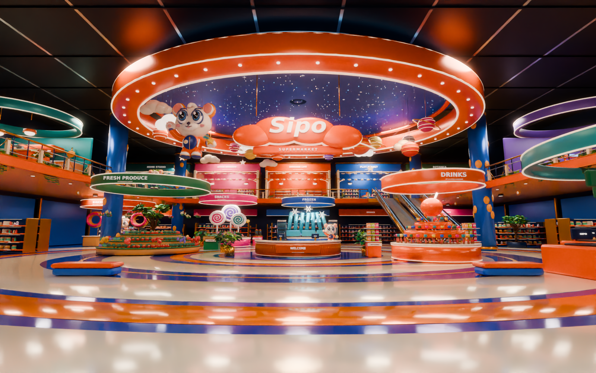
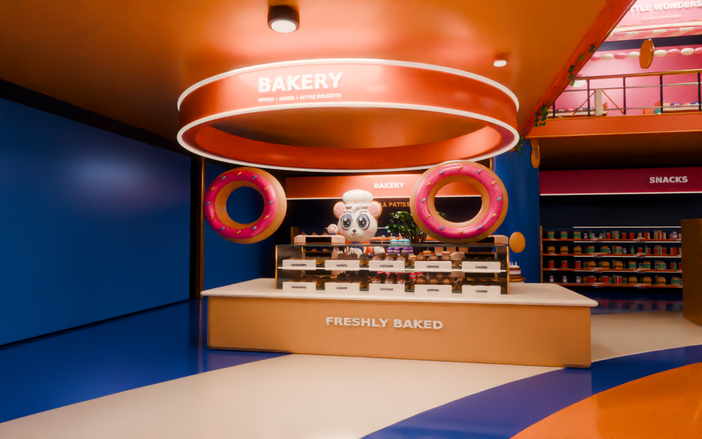
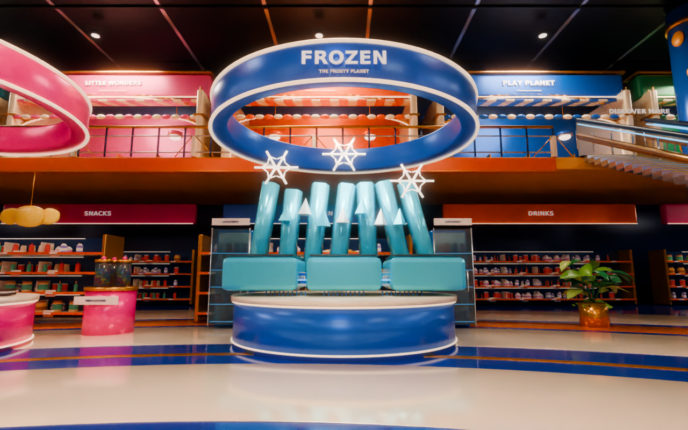
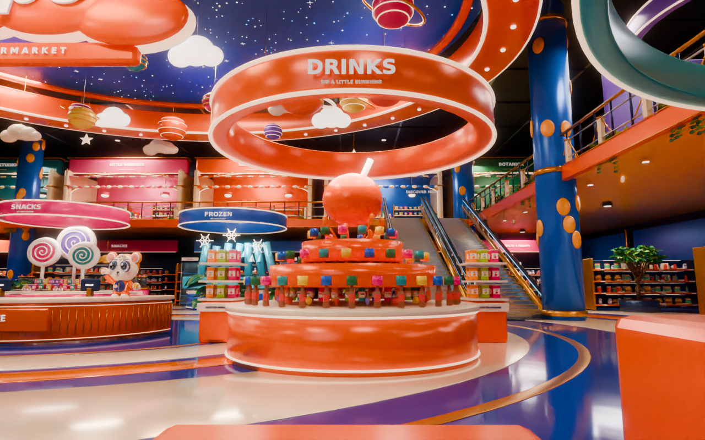
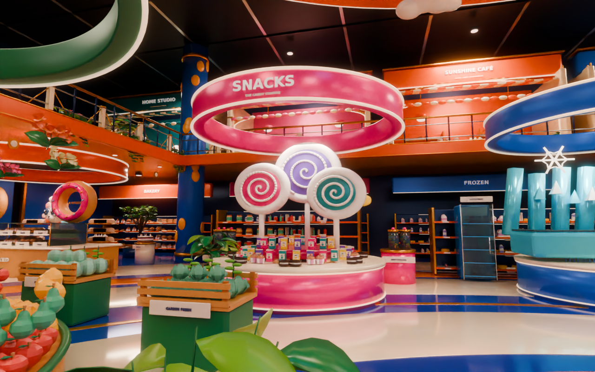
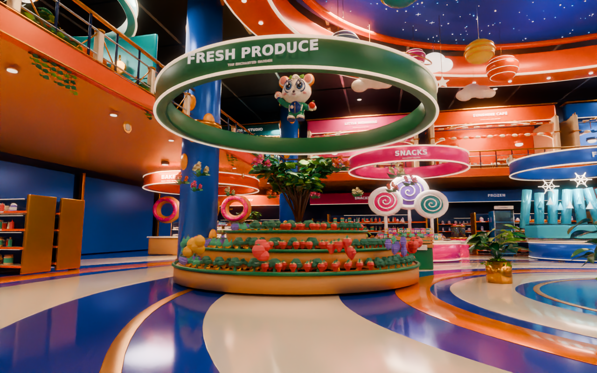
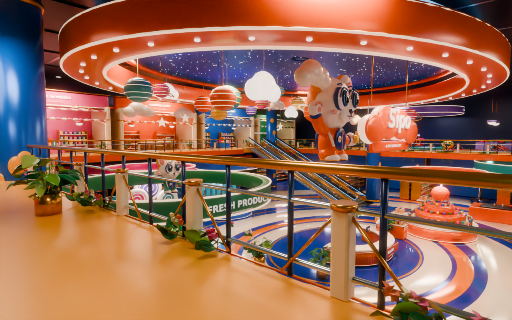
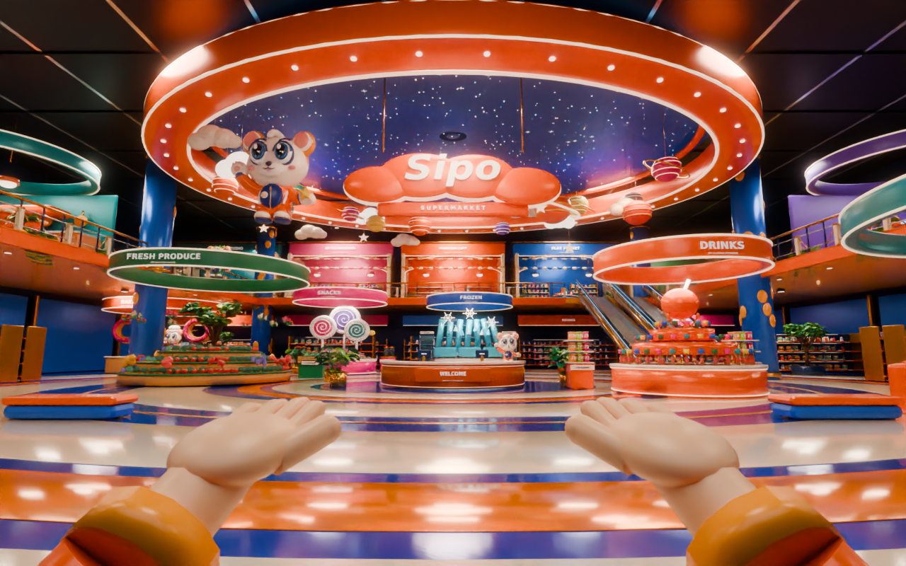
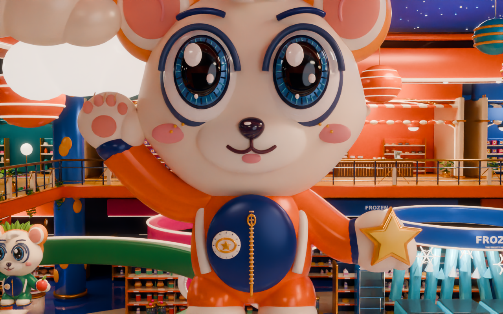

# Grand retail hall — current render gallery

Eight requested views and a mascot close-up, rendered from the complete 3D source with Blender Cycles. [Art upgrade report](ART_UPGRADE.md) · [Full preview and Unity guide](PREVIEW_GUIDE.md). Click any image for its PNG.

## Central atrium

## Bakery

## Frozen

## Drinks

## Snacks / candy

## Fresh produce

## Mezzanine / upper level

## First-person with static hands

## Flagship mascot detail

