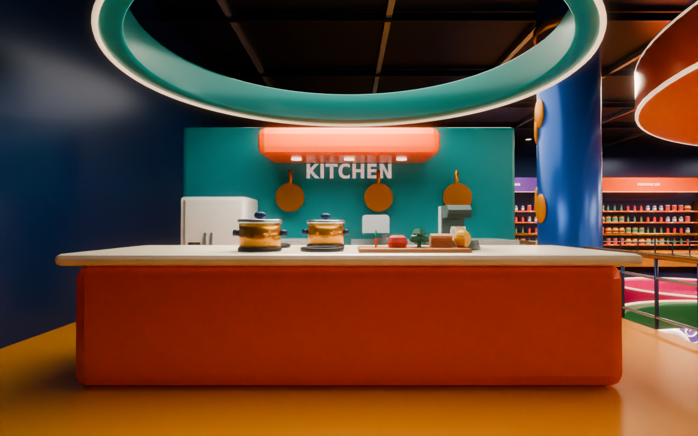
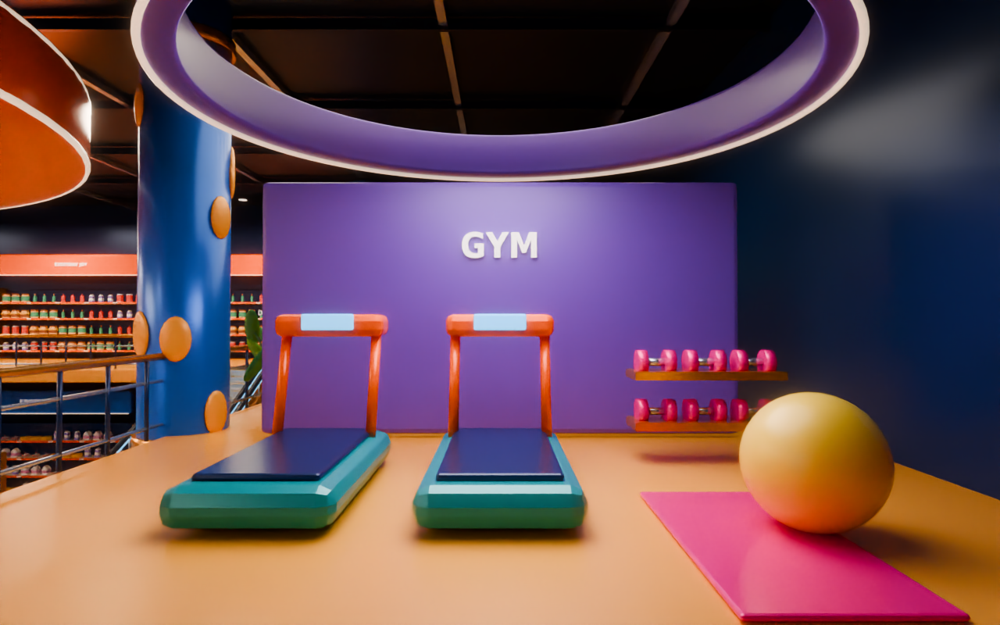
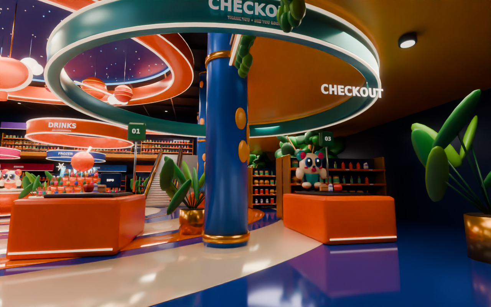
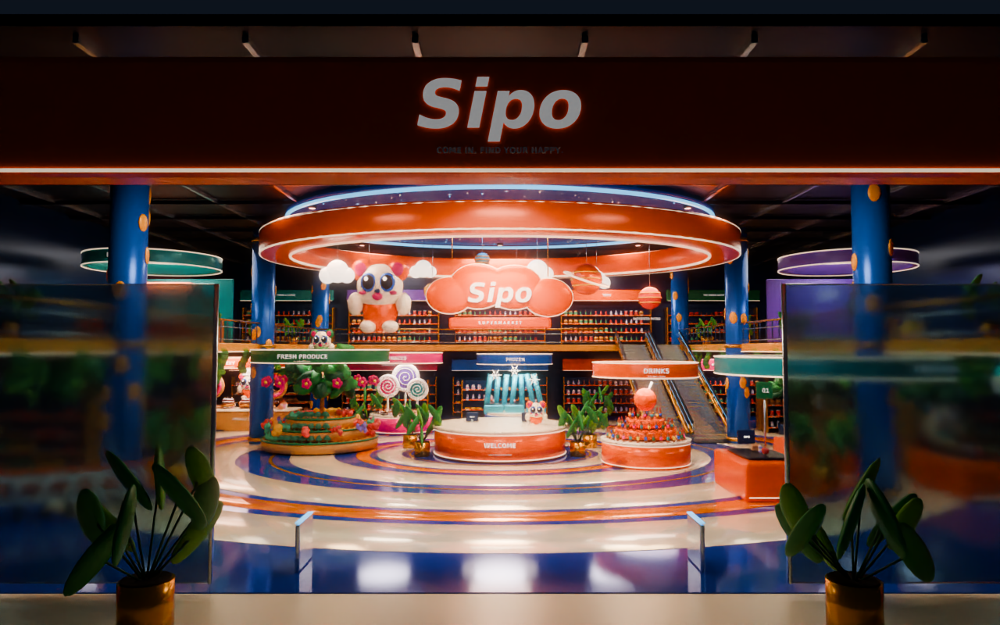

# Redesigned supermarket — render gallery

Actual Blender Cycles renders of the supplied 3D environment, not Unity screenshots. Click any image for its full PNG. [Preview instructions](PREVIEW_GUIDE.md) · [Art changes and remaining differences](ART_REDESIGN.md).

## Central atrium

## Fresh produce

## Bakery

## Snacks / candy

## Drinks

## Frozen

## Kitchen

## Gym

## Checkout

## First-person view with static hands

## Mezzanine overview

## Grand entrance

